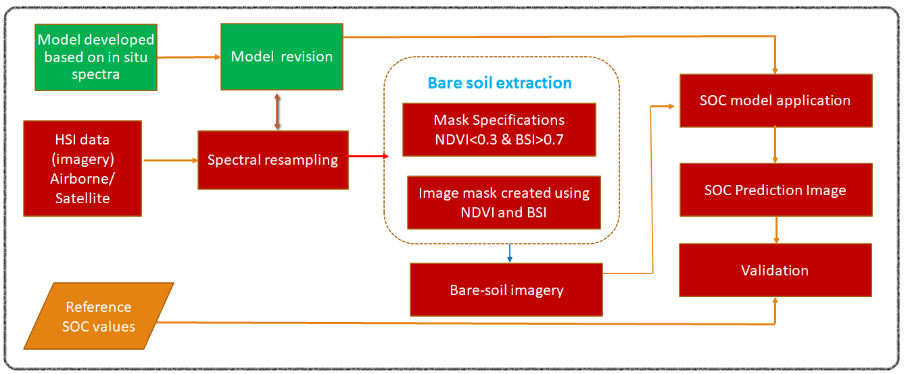
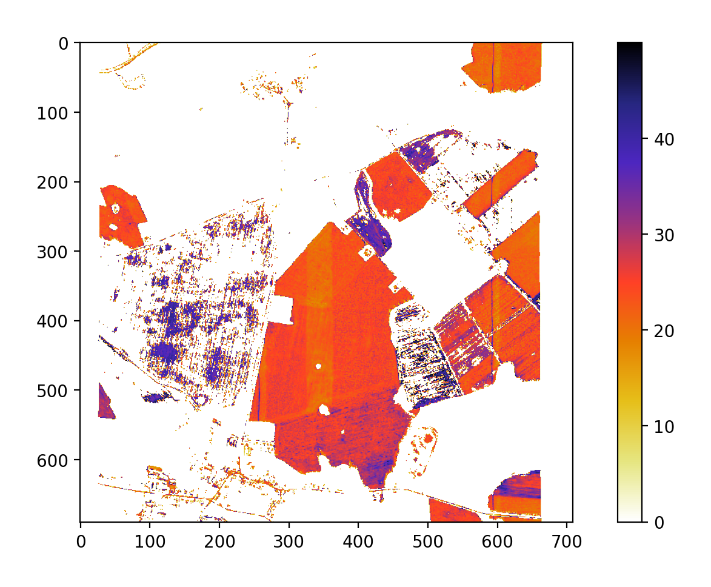
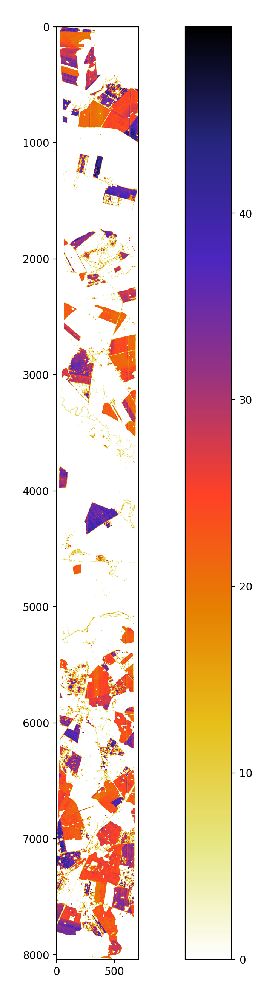

# Soil_Organic_Carbon_Hyperspectral_Imagery_Regression

## Description
Soil is a natural sink for Carbon. Soil Organic Carbon (SOC) content is directly related to crop yield, moisture retention capacity and nutrient status of the soil. Lab methods of SOC estimation are time consuming and produce non-biodegradable by products. Various studies on crop yield and crop health has been done but very less attention has been given to soil qualities estimation i.e SOC.

## Workflow

## Random Forest Regression Prediction | Subset Image

## Random Forest Regression Prediction | Full Image

## Spectral Bands

## Actual Vs Predicted

## Image Comparision | SOC_Predction -- Masked_Hyperspectral_image -- Original_RGB_Bands_of_Hyperspectral

